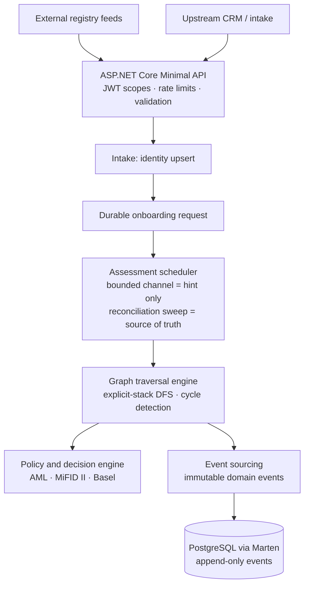
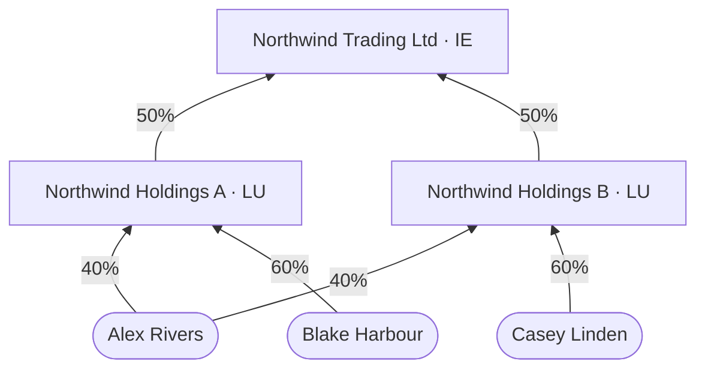
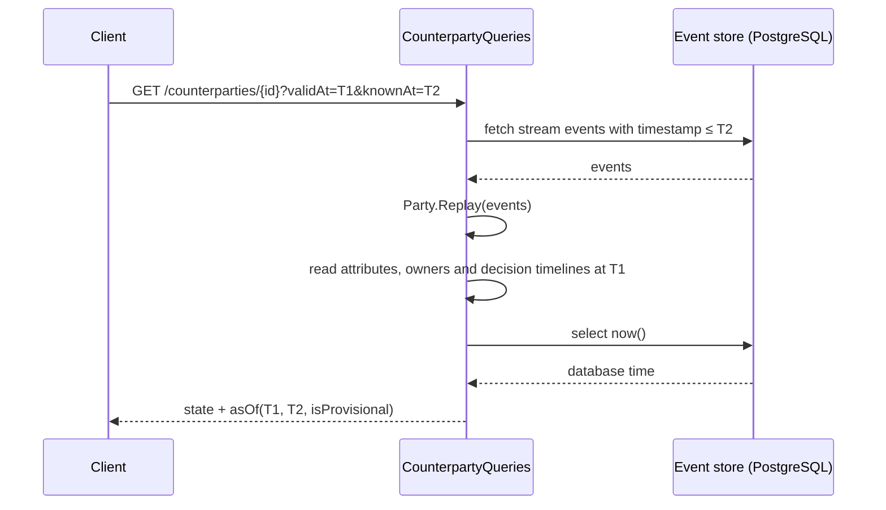
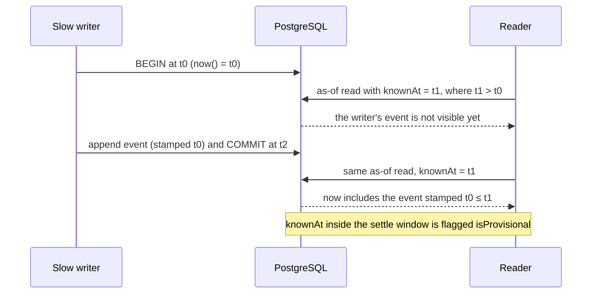
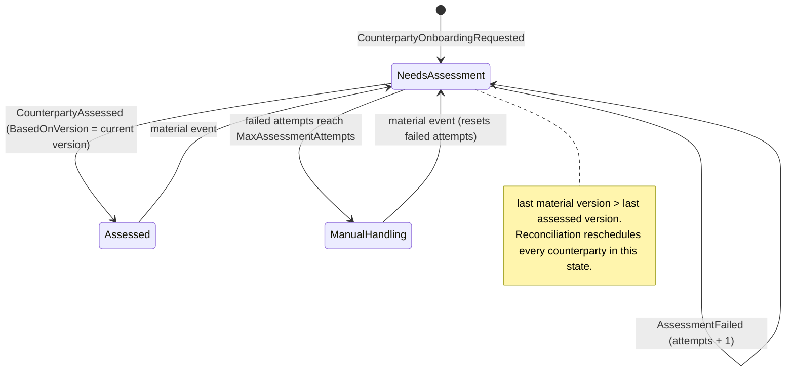

A bank can't take on a corporate client until it knows who's behind it. Not the company on the form. The people.

That sounds simple. It rarely is. A trading company is owned by two holding companies. Those are owned by other companies, sometimes in other countries. One person can hold a stake through several routes at once. Sometimes company A owns part of B, and B owns part of A.

Then the auditor turns up. They don't ask what you know today. They ask what you knew on 3 March, and why you decided what you did.

I built AegisClm to work through those problems properly. It's a client lifecycle management and KYC/AML decisioning service for corporate banking. It's written in .NET 10 and C# 14, with Marten event sourcing on PostgreSQL. It's a portfolio project. The aim is engineering that holds up against the actual legal texts.

This post walks through five diagrams from the repo. Nothing here is legal advice.

## The Shape of the System

Feeds come in through a Minimal API with JWT scope policies, rate limits and validation. Intake upserts each party by identity. That's an LEI, or a source system plus an external reference. The durable onboarding request is committed in the same transaction.

Every party is one event stream. That covers the counterparty, each holding company and each natural person. Shared identity matters here. It lets a change deep in one structure reach every counterparty above it.

The scheduler hands work to the graph traversal engine, which resolves the owners. The policy and decision engine then applies the AML rule set. It also runs MiFID II categorisation under Directive 2014/65/EU Annex II. It also forms Basel LEX10 connected counterparty groups. Everything lands as immutable events in one PostgreSQL database. Query documents are written in the same transaction.

The spec's full diagram has more boxes. A FAPI 2.0 gateway, a graph store and downstream dispatch are roadmap items. I've left them out.

## Adding Up the Diamond

Northwind Trading Ltd is owned 50/50 by two holding companies. Alex Rivers owns 40% of each. Blake Harbour owns the other 60% of Holdings A. Casey Linden owns the other 60% of Holdings B.

Effective ownership multiplies along each path and adds across paths. Alex gets 0.4 × 0.5 = 20% through each holding company. That's 40% in total. Blake and Casey get 30% each.

Here's the trap. Revision 1 of the spec tested the threshold on each path separately. Neither of Alex's 20% paths passes a 25% test. So Alex, the largest owner, would have been missed. The fix is to sum first and test once. AMLR Art 52(1) reads that way too: multiply along chains, add across them. A named test, `TwoPathsOf20Percent_SumTo40_IsUbo`, pins it.

The comparison operator matters just as much. Under Directive 2015/849 Art 3(6)(a)(i), a UBO holds **more than** 25%. From 10 Jul 2027, Regulation 2024/1624 Art 52(1) and Art 90 say **25% or more**. So rule sets are chosen by the valid time being assessed. The operator is data, not code.

The walkthrough in the README shows why that detail bites. A registry correction says Alex only ever held 10% of Holdings A. Blake held the other 90%. Alex now holds 0.5 × 0.1 + 0.5 × 0.4, which is exactly 25%.

| Question | Rule set | Alex |
|---|---|---|
| Known before the correction, about June 2026 | EU-AMLD | 40%, qualifies |
| Known now, about June 2026 | EU-AMLD | 25%, doesn't qualify |
| Known now, about August 2027 | EU-AMLR | 25%, qualifies |

Same person, same shares, three answers. Each one is right for the question asked. Weights are `decimal`, and the comparison uses the exact summed value. Rounding only happens at presentation.

## What Did You Know, and When?

Each fact has two times. Valid time is when it was true. Transaction time is when the bank recorded it. Valid time arrives in the payload and is never defaulted from a server clock. Transaction time is the event's timestamp, and PostgreSQL assigns it.

An as-of read replays the party's stream up to `knownAt`. It then reads each valid-time timeline at `validAt`. There's no second copy of history in a table. History always comes from the events, so it can't drift from them.

Two separate questions come out of this. `GET /counterparties/{id}` with `knownAt` returns what the bank concluded, as recorded then. The `/ubo` endpoint recomputes the structure from what was known. It uses the rule set in force at `validAt`. A retroactive correction changes the second answer for later knowledge times. It never changes the first.

There's a catch with the database clock. PostgreSQL's `now()` is the start of the writing transaction, not the commit.

A slow writer can commit after a reader's query, with an earlier stamp. The same as-of read then gives a different answer. So answers with `knownAt` inside a settle window come back flagged `isProvisional`. The window is 30 seconds by default. A test shows the anomaly on PostgreSQL itself.

## The Assessment Lifecycle

Nobody sets an assessment flag by hand. The state comes from the stream. A counterparty needs assessment when its last material version is newer than its last assessed version.

Material events include a new shareholder register, changed legal attributes, declared senior managing officials and screening hits. Any of them sends an assessed counterparty back to `NeedsAssessment`. That's perpetual KYC. You re-check when facts change, not every one, three or five years.

`CounterpartyAssessed` records `BasedOnVersion`. If the stream hasn't moved since, a duplicate delivery is skipped. Failures append `AssessmentFailed`. After five attempts with no new material change, the counterparty goes to `ManualHandling` instead of looping. A new material event resets the count.

## Decisions Worth Stealing

**Explicit-stack DFS with bounded work.** The resolver uses its own stack, not recursion. A chain 100,000 entities deep can't overflow the call stack. Paths below `PruneBelow` (1% by default) aren't followed. Intake guarantees incoming equity into any party is at most 100%. So path weights at any one depth sum to at most 1. The traversal visits at most (MaxDepth + 1) / PruneBelow frames, whatever the graph size. A property test checks that bound on random graphs.

**A closed result type.** Resolution returns `UbosIdentified`, `SeniorManagingOfficialsFallback` or `ResolutionIncomplete`. Cycles give `ResolutionIncomplete`. So does the depth limit, or pruned weight that could lift someone over the threshold. AML tiering treats that outcome as high risk. "Couldn't tell" is never reported as "no owner". A property test against a naive oracle found the pruning counterexample behind that rule.

**The database clock for transaction time.** Marten 9's default append mode stamps events with the .NET clock. Quick mode uses PostgreSQL's `now()`, except when a stream is started. So AegisClm uses Quick mode and creates streams with an expected-version append. A characterisation test pins this against the installed Marten version. An upgrade that changes it fails loudly.

**The channel is a hint. The sweep is the truth.** Assessment goes through a bounded `System.Threading.Channels` buffer with room for 1,024. Producers call `TryWrite`, so a request never blocks. A full buffer just drops the hint. The stream records the need durably. A reconciliation sweep runs at start-up and every 30 seconds, and reschedules anything pending. Correctness never depends on memory.

**Layer rules as tests.** ArchUnitNET enforces the dependency direction and keeps the Domain free of package references. It also stops event payloads from holding domain value objects. A refactor can't quietly change the stored format. ArchUnitNET refuses rules that match no types, so a rename can't make one pass with nothing to check.

**Mutation score as a gate.** Stryker.NET rewrites the Domain code and checks that some test fails for each change. The score is 91.78%. Of 535 mutants, 489 were killed and 2 timed out. CI fails below 80%.

## Benchmarks

These come from BenchmarkDotNet's ShortRun job on an Apple M1 Pro. The run used .NET 10.0.12 on 25 September 2026. ShortRun is quick, so treat the numbers as indicative. The full report is `docs/benchmarks/AegisClm.Benchmarks.UboResolutionBenchmarks-report-github.md`.

The graphs are synthetic layered structures. Each entity is owned by up to three entities and one person.

| Entities | Build graph snapshot | Resolve UBOs | Resolve allocations |
|---:|---:|---:|---:|
| 1,000 | 0.53 ms | 6.4 µs | 7.97 KB |
| 10,000 | 6.0 ms | 6.4 µs | 7.97 KB |
| 100,000 | 96 ms | 6.5 µs | 7.97 KB |

Resolution stays flat as the graph grows. That's the pruning bound at work. The cost sits in building the snapshot. So the infrastructure only loads the network above the target. It uses one indexed query per level.

One result overturned the spec. It suggested `FrozenDictionary` for the adjacency index. For this build-once, read-once pattern it was 5% to 45% slower than `Dictionary`. It also allocated 28% to 31% more. That's in `docs/benchmarks/AegisClm.Benchmarks.AdjacencyIndexBenchmarks-report-github.md`. `FrozenSet` stays for the long-lived high-risk jurisdiction list.

It isn't production software. Personal data is stored unencrypted in this version, and FAPI 2.0 isn't built. The code, spec, nine ADRs and 330 tests are at [github.com/denismurphy/aegis-clm](https://github.com/denismurphy/aegis-clm). Start with `spec.md` §3.1 if you want the maths.
