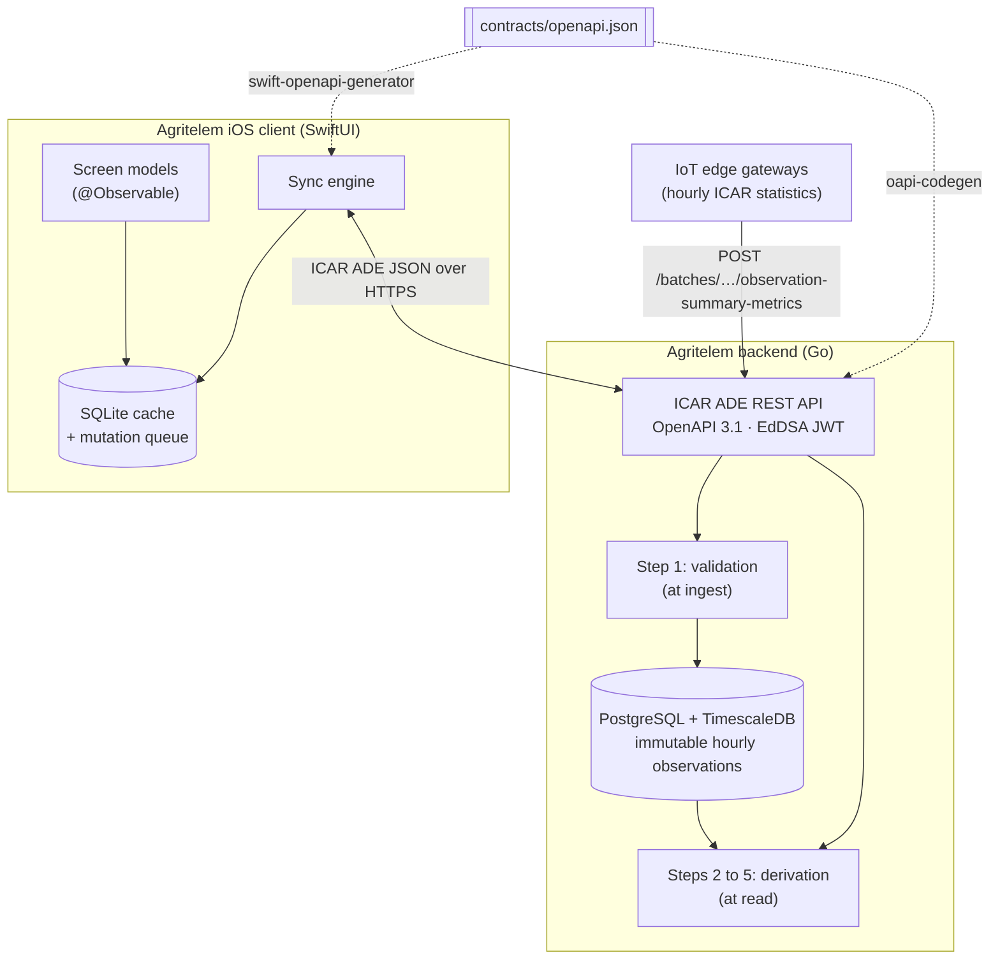
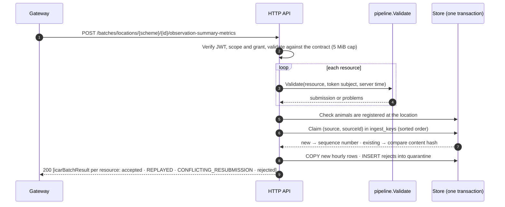
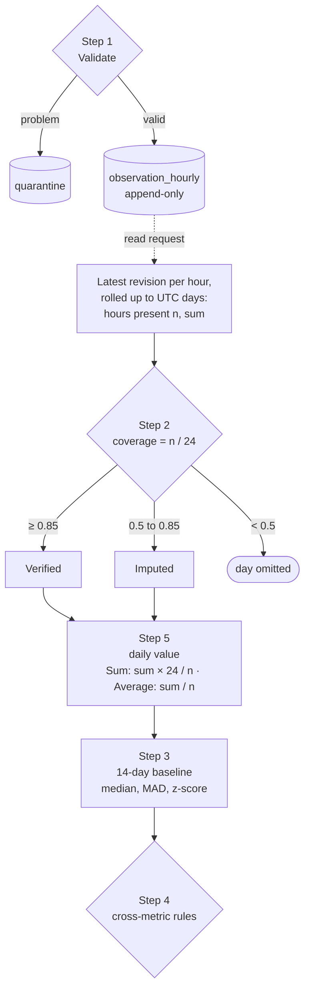
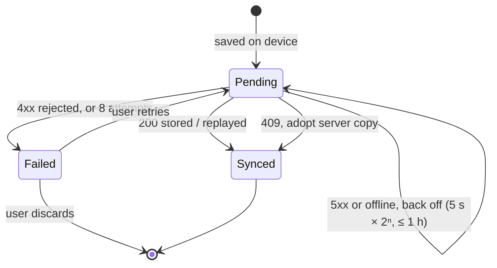

A dairy cow can carry three sensors at once. A rumen bolus reads her temperature from the inside. A pedometer counts her steps. A collar tracks how long she chews the cud.

Those numbers matter because a cow can't tell you much. Rumination drops when she's ill, stressed or in estrus. Steps spike during estrus. A sustained high temperature points to heat stress or fever. Farmers call estrus "heat". They need a clear signal for it, and another for heat stress.

The sensor isn't the hard part. Everything between the sensor and the farmer's phone is. Farm connectivity is patchy. Gateways retry uploads and send duplicates. Hours arrive late or never. Sensors drop out and throw odd readings. The farmer still wants a plain answer each morning.

Agritelem is my attempt at that whole path. There's a Go backend on TimescaleDB and an offline-first SwiftUI app. They share one OpenAPI 3.1 contract built on ICAR Animal Data Exchange (ADE) 1.5.1. ADE is the standard for moving livestock data between farm systems. I work in dairy tech at Dairymaster by day. Agritelem is a personal project, not a Dairymaster one.

Four diagrams carry most of the design. Here they are, adapted from the spec.

## One Contract, Two Generated Ends

Everything starts at `contracts/openapi.json`. A small Go tool, `contractgen`, builds it. The inputs are the vendored ICAR bundle and one extension file, `agritelem.yaml`. oapi-codegen turns the contract into the Go server. swift-openapi-generator turns the same file into the Swift client. The server and the app can't drift apart without the build noticing.

Gateways send hourly ICAR statistics to one batch endpoint. The API checks an EdDSA-signed JWT and validates the request against the contract. Then it runs step 1 of the cleaning pipeline. Only valid hourly observations land in TimescaleDB. Steps 2 to 5 run later, when someone reads a summary.

On the phone, screen models read from a local SQLite cache first. The sync engine moves data between that cache and the API when there's signal. So the app shows cached data straight away and refreshes when it can.

Why summarise at the gateway? Three accelerometer axes at 20 Hz give 216,000 samples per animal each hour. Five hourly statistics replace all of that. That's a cut of more than 99.99 % in bandwidth.

## Ingest: Safe to Retry, Safe to Reject

Gateways deliver at least once. A lost response means a retry, and a retry mustn't create a second copy. Every resource carries `meta.source` and `meta.sourceId`. The source must match the token's subject. One gateway can't write as another.

Each resource is validated and reported on its own. A bad one doesn't sink the batch. It goes to `quarantine` with every problem listed, not just the first. The rules are specific. Timestamps must be UTC. Windows must start on the hour. Values must sit inside the metric's hourly bounds. Nothing can be stamped more than 5 minutes ahead of server time.

Then comes the ledger. Inside one transaction, the API claims each `(source, sourceId)` in `ingest_keys`. A new key gets a sequence number. Its hourly rows go in with a bulk `COPY`. A known key with the same content hash comes back `REPLAYED`. A known key with different content is a `CONFLICTING_RESUBMISSION`. The hash leaves out `meta.modified`, because retries may restamp it.

The response is always a 200 with one `icarBatchResult` per resource. The gateway learns exactly what happened to each one.

## Cleaning: Grade the Day Before You Trust It

Step 1 runs at ingest and decides what gets stored. Steps 2 to 5 run at read time over the stored hours. That split is deliberate. Hours arrive late and out of order. One late hour can change the following 14 days' baselines. Stored baselines would need recomputing on every late insert. Derived ones are never stale.

Coverage comes first. The store takes the latest revision of each hour. Then it rolls hours into UTC days. A day with at least 85 % of its hours is Verified. From 50 % up to 85 %, it's Imputed. Below 50 %, the day is omitted. Sum metrics scale up to a full day at the observed hourly mean. Average metrics use the mean of the hours present.

Step 3 compares each day with that cow's own previous 14 days. At least 7 of those days must exist. The baseline uses the median and the median absolute deviation (MAD). The multiplier 1.4826 × MAD estimates the standard deviation. Yet one odd day barely moves that estimate. Step 4 applies cross-metric rules. `HeatSignature` fires when rumination z ≤ −1.5 and steps z ≥ 2.0 on the same day. `ThermalStress` fires at a daily mean reticular temperature of 39.5 °C or more.

There's an honest weakness here. Mean imputation assumes every hour looks alike, and they don't. In a simulated run, a sensor dropped out from 08:00 to 18:00. Imputed rumination came out at 595 min against a baseline near 470. Cows ruminate least in daytime, so the night-heavy hours that remained inflated the day. Agritelem labels that day Imputed and leaves it out of herd means. The planned fix imputes from each animal's hour-of-day profile.

## Remarks: A Queue That Survives the Barn

Farmers also log what they see. "Mounting behaviour observed at milking" is the sort of remark I mean. The composer stamps `meta.source`, a new `meta.sourceId` and `meta.modified`. It writes the remark and its queued upload in one SQLite transaction. That works with no signal at all.

Each remark starts as Pending. A 200 means the server stored the remark or recognised a replay. A 409 means the same source ID arrived with different content. The app adopts the server copy there, because the server wins for events. Each path ends in Synced.

Network failures and 5xx responses keep the remark Pending. The engine backs off from 5 s, doubling each time, capped at 1 h. The failure also stops the whole pass, so later uploads never overtake earlier ones. A 4xx rejection, or 8 failed attempts, moves the remark to Failed. Failed remarks sit under Needs Attention in Settings. The user can retry or discard them there.

A 401 gets its own handling. Sync pauses and asks the user to sign in, without spending an attempt. The red-team pass caught a proxy's 401 being treated as transient. That bug would have meant retrying forever. A test now pins it.

## Decisions Worth Stealing

**Keep the idempotency ledger outside the hypertable.** TimescaleDB won't build a unique index that omits the partitioning column. So `(source, sourceId)` can't be unique on `observation_hourly` itself. ADR 0004 moves that key into a plain `ingest_keys` table. Keys are claimed in sorted order inside the batch transaction. Concurrent batches then queue on the unique index instead of deadlocking. A test sends one key from eight concurrent writers.

**Let the database stop double-booked collars.** A device can't be on two cows at once. A `btree_gist` exclusion constraint on `device_assignments` enforces that. The rule lives in the schema, not just in Go.

**Test UTC days from UTC+14.** Day boundaries come from `date_trunc('day', hour_start, 'UTC')` in SQL. The session time zone has no say. A test proves it by querying through a UTC+14 session. If the session zone leaked in, that test would split days in the wrong place.

**Take sync watermarks from the server.** The pull watermark is the newest `meta.modified` the server returned. It advances only after every page is applied. Each pull re-reads 60 s before the watermark. A transaction can commit after a later-stamped one. Re-applying a record is harmless. The phone's clock never decides what gets pulled.

**Extend the standard, but only by adding.** `agritelem.yaml` may add paths under `/agritelem/`. It may add schemas, properties, parameters and responses too. The build fails if the extension changes any ICAR value. Derived fields ride in an `agritelem` object on each statistic. Every ICAR constraint still holds.

## Performance, With Its Caveats

These figures were measured with `make sim` on 26 Sep 2026. That was one Apple-silicon laptop. The API and database ran in local Docker. The simulator sent 62,590 hourly statistics for 24 animals. Batches held 100 resources, about 6.7k statistics each, with 4 concurrent requests.

| Metric | Result |
|---|---|
| Throughput | ≈ 169,000 statistics/s |
| Request latency | p50 141 ms, p99 191 ms |
| Re-run (all replays) | 936 of 936 resources `REPLAYED`, zero new rows |

That's one machine, not a capacity claim. The spec's target is 10,000 observations/s under 200 ms. The run shows ingest isn't the bottleneck on that setup. The re-run tells me more. Every resource came back as a replay, and not one row was duplicated.

The spec, six ADRs and the gateway simulator are in [denismurphy/agritelem](https://github.com/denismurphy/agritelem). Run `make up`, `make seed` and `make sim`. Then paste a `make token` into the app's Settings.
