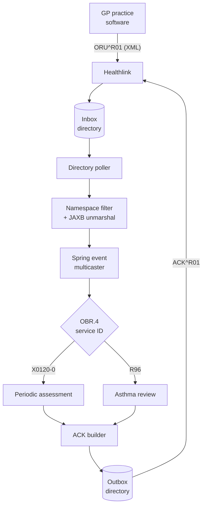
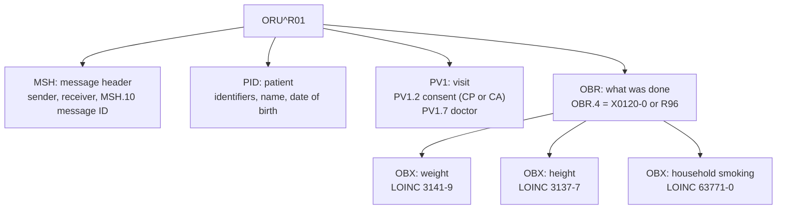
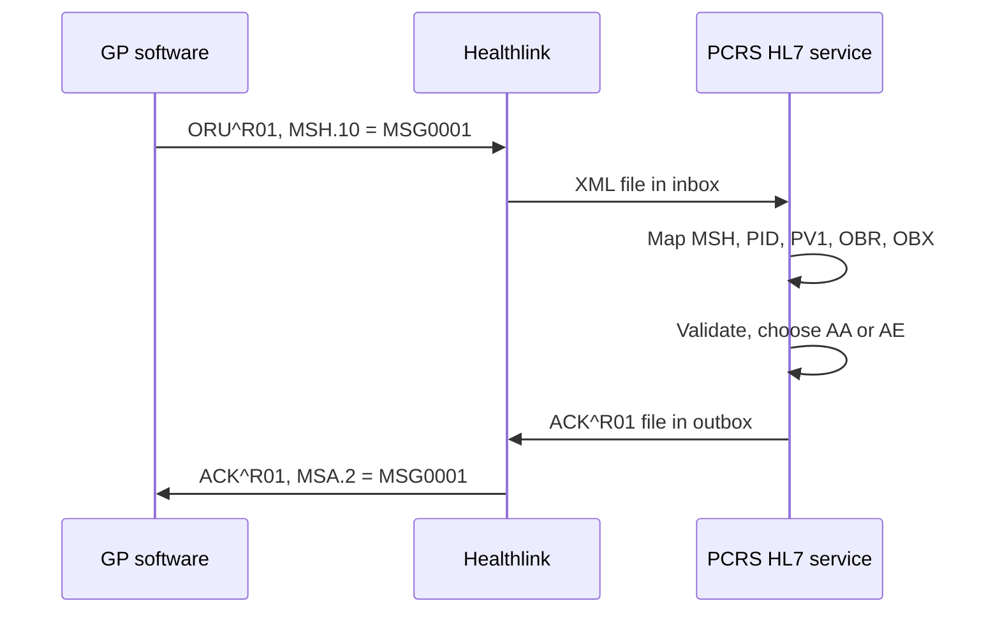

In 2015 the State made GP visits free for children under six.

The scheme also paid GPs for extra care. Two items mattered to my code: periodic health checks and asthma reviews. Every one of those visits had to reach the Primary Care Reimbursement Service (PCRS), part of the HSE.

GP practices don't send emails for this. Their practice software sends HL7 messages over Healthlink, the national clinical messaging service. In early 2016, at Quest Computing, I built the service that received them for PCRS.

This post walks through that service with diagrams. Then it looks at the same problem in FHIR R5, which I've been working with again recently.

## The Message Flow

HL7 v2 is usually pictured as pipes and carets over a TCP socket. This wasn't that.

Healthlink delivered each message as an XML file. It used the official HL7 v2.4 XML encoding. So the service watched a directory, not a port.



A poller picked up each new file. A guard set stopped the same file being grabbed twice.

JAXB turned the XML into typed Java objects. Those classes were generated from the HL7 v2.4 XML schemas, so a malformed segment failed at parse time.

Each parsed message became a Spring application event. The multicaster ran listeners on a thread pool, so one slow file didn't hold up the rest. Unknown message types went to their own listener, which logged them.

## Anatomy of an ORU^R01

ORU^R01 means "unsolicited observation result". The GP is reporting what they found, without being asked. That fits a health check well.



The OBR segment said which service the visit was. `X0120-0` was a periodic assessment. `R96` was an asthma review, using the ICPC-2 code for asthma.

Each OBX carried one result. Weight, height, household smoking and self-management plans used LOINC codes. Scheme items with no LOINC code, like "inhaler technique reviewed", used local `X01xx` codes.

Consent rode in an odd place. PV1.2 is normally the patient class, like inpatient or outpatient. The scheme's message guide reused it: `CP` meant consent present, `CA` meant consent absent.

Here's a made-up OBX in the XML encoding the service read, with its pipe form below:

```
<OBX>
  <OBX.3><CE.1>3141-9</CE.1><CE.2>Body weight</CE.2><CE.3>LN</CE.3></OBX.3>
  <OBX.5>18.2</OBX.5>
  <OBX.6><CE.1>kg</CE.1></OBX.6>
</OBX>

OBX|1|NM|3141-9^Body weight^LN||18.2|kg
```

Same data, twice the bytes. The XML form did buy one thing, though. The schemas could check structure before any of my code ran.

## Closing the Loop With an ACK

Every message needed an answer. Without one, the GP system can't tell if PCRS got the visit.



The ACK is small, but each field has a job.

- **MSH sender and receiver swap.** The ACK travels back the way the message came.
- **MSA.1 carries the verdict.** `AA` is application accept. `AE` is application error.
- **MSA.2 echoes MSH.10.** That's how the GP system matches the ACK to its message.

## Lessons From the Vendor Side

Standards are only as tidy as the systems that send them. Two small fixes taught me more than the spec did.

**Some senders left out the XML namespace.** Strict JAXB would reject those files. A SAX filter in front of the parser added the HL7 namespace back, so the files parsed.

**Some receivers couldn't read prefixed XML.** JAXB writes `ns2:` prefixes by default. A custom stream writer emitted the HL7 namespace as the default one instead. The output was identical in meaning, but more vendors could read it.

**Unknown codes were logged, not rejected.** An OBX code the service didn't know was skipped with a warning. Rejecting a whole visit over one extra field would have cost GPs their payment.

**Each environment had its own profile.** Dev, test, QA, UAT and production each got a Spring profile. Production secrets stayed encrypted at rest.

## The Same Job in FHIR R5

Ten years on, I rebuilt a close cousin of this problem. [OpenClaim Core](/blog/openclaim-core-fhir-r5-claims/) takes hospital claims as FHIR R5 Bundles and sends them to a payer.

The segments map onto FHIR resources fairly directly:

| HL7 v2 segment | Job | FHIR R5 resource |
|---|---|---|
| MSH | Who sent what, and its ID | `Bundle` (and `MessageHeader` in messaging) |
| PID | The patient | `Patient` |
| PV1 | The visit | `Encounter` |
| PV1.2 (as the scheme used it) | Consent | `Consent` |
| OBR | The service ordered or done | `ServiceRequest`, `DiagnosticReport` |
| OBX | One result | `Observation` |
| MSA | Accept or error | `OperationOutcome`, or a `ClaimResponse` for claims |

The mapping is the easy part. Here's what changed underneath.

**Position became name.** In v2, meaning lives in field numbers. PV1.2 is whatever the message guide says it is. In FHIR, consent is its own resource, and nobody has to remember a field number.

**Pointers replaced nesting.** An ORU nests OBX under OBR by position. A FHIR Bundle links resources by reference, like `Claim.patient` pointing at a `Patient`. OpenClaim rejects a Bundle if any reference doesn't resolve inside it.

**Errors got an address.** An `AE` tells the sender that something failed. A FHIR `OperationOutcome` can carry a FHIRPath expression, like `Coverage.subscriberId`. The sender knows exactly which element to fix.

**The transport grew up.** Healthlink moved files between trusted parties. OpenClaim takes HTTPS with OAuth 2 bearer tokens, and uses mutual TLS to the payer.

**Some problems didn't change at all.** Senders still retry. Messages still arrive twice. The ACK in 2016 echoed a message ID so the sender could match it. In 2026, OpenClaim fingerprints each claim so a resend replays the first answer instead of billing twice.

That last point is why I keep coming back to healthcare messaging. The formats change every decade. The duty to count every visit exactly once doesn't.
