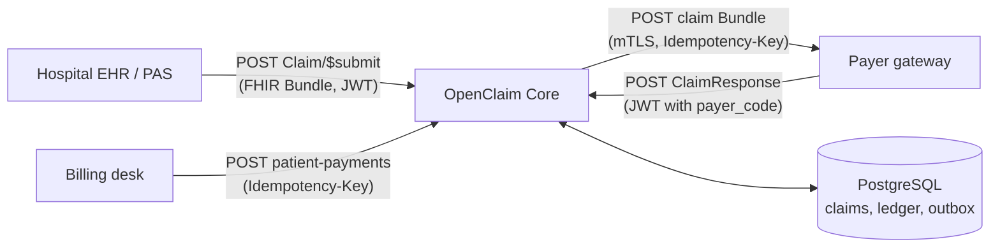
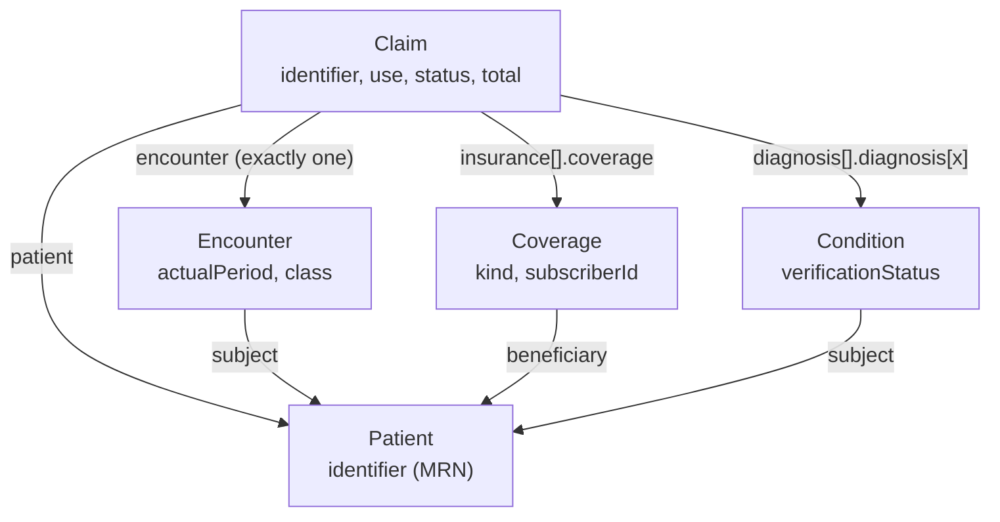
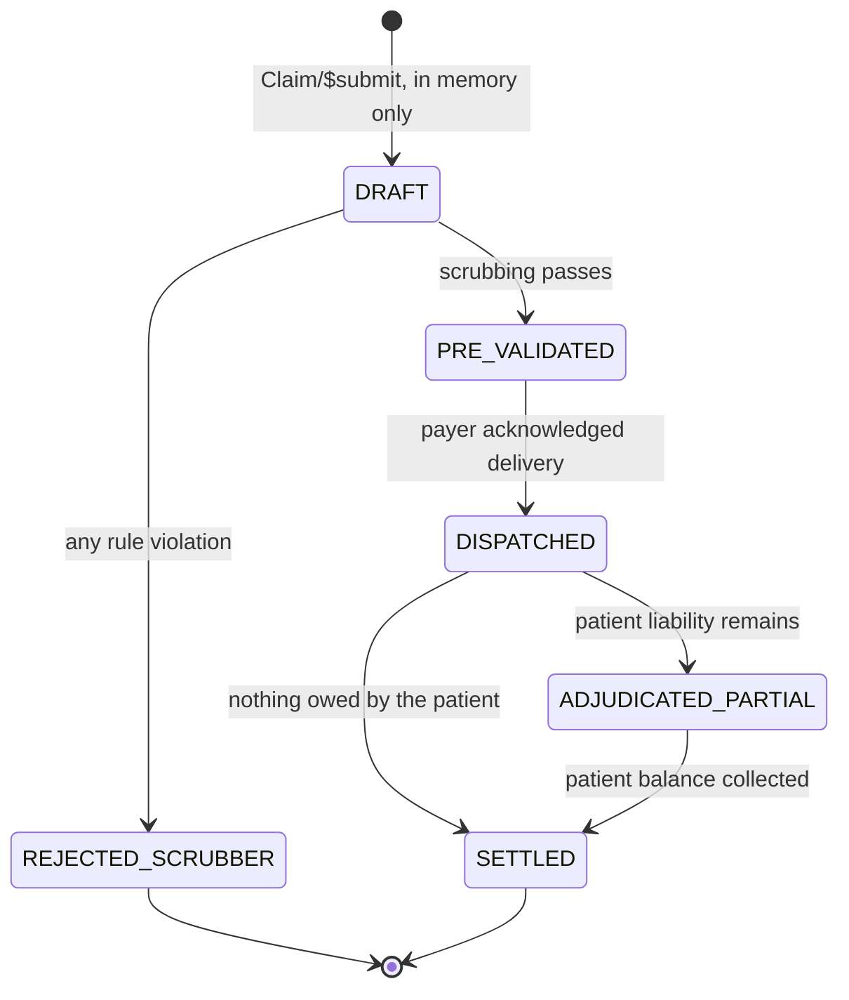
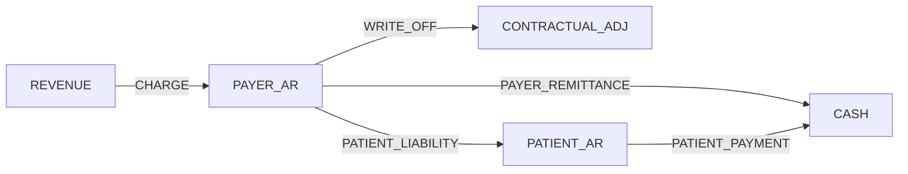
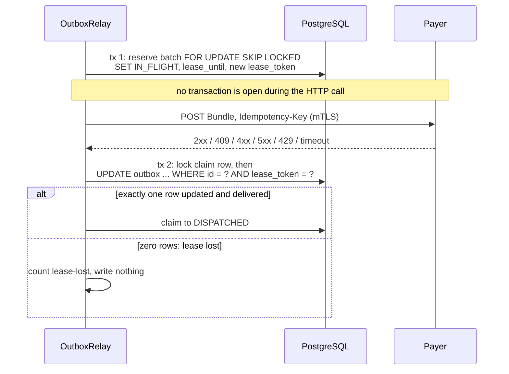

A hospital treats a patient. Somebody has to get paid for that.

The hospital's system sends a claim. An insurer, the payer, decides how much it'll cover. The patient owes the rest. Every euro has to land in the right account. The books must still add up at the end.

Then the network gets involved. Requests time out. Systems retry. A claim sent twice mustn't be billed twice. A payer that answers twice mustn't be booked twice.

I built OpenClaim Core to handle that part properly. It's a claims clearinghouse on HL7 FHIR R5, written in Java 25 with Spring Boot 4.1. The happy path is easy. This post is about the rest.

Years before this, I built HL7 v2 messaging for the HSE. I've written about [going from HL7 v2 to FHIR R5](/blog/hse-hl7-v2-to-fhir-r5/) separately.

## The Big Picture

Three parties talk to the engine. The hospital's EHR or PAS submits a claim as a FHIR Bundle through `Claim/$submit`. The billing desk records what patients pay. The payer gateway receives claims and posts its adjudication back as a `ClaimResponse`.

PostgreSQL holds the claims, the ledger and the outbox. Every caller presents an RS256 bearer token. Calls out to the payer use mutual TLS and carry an `Idempotency-Key` header.

The payer's token carries a `payer_code` claim. That code decides which claims the payer may adjudicate. The request body can't override it.

## What's in the Bundle

The EHR sends a `collection` Bundle with the Claim as its first entry. Everything else hangs off that Claim.

Each resource gives the engine one or two things. Patient gives the MRN, the identifier whose system is configured. Name, birth date and gender aren't read at all, which is data minimisation on purpose. Encounter gives the date of care through `actualPeriod` and the care setting through `class`. Coverage gives the policy number through `subscriberId` and says whether it's insurance at all through `kind`. Condition gives the diagnosis, and its `verificationStatus` can rule that diagnosis out.

The arrows back to Patient matter. Encounter, Coverage and Condition must all be about the claim's patient. A Bundle that mixes patients gets a 422, and nothing is stored.

The mapper only refuses what can't be identified, stored or trusted. Missing business data, like a missing MRN, goes through as null. The scrubber then records it as a violation on a stored, rejected claim. The submitter gets an auditable answer instead of a bare error.

## The Claim State Machine

Six states, and every move goes forward. `DRAFT` only exists in memory during ingest. A claim reaches the database already scrubbed.

The scrubber runs four ordered rules: administrative, clinical indication, care setting and bundling. Every rule runs and every violation is recorded. One violation is enough to reject the claim. Collecting them all lets the submitter fix everything in one round trip.

`REJECTED_SCRUBBER` is terminal. A corrected claim comes back under a new `Claim.identifier`. A contractual write-off alone doesn't make a claim partial. `ADJUDICATED_PARTIAL` means the patient still owes something.

The transitions live in an exhaustive `switch` in `ClaimStatus.canTransitionTo`. Add a status without deciding its exits and the build fails. A 6×6 table test pins every allowed and forbidden pair.

## Where the Money Goes

Each arrow is one journal. Money moves from the credited account to the debited one. Debits are positive, credits are negative, and every journal sums to zero.

Why double entry? Patient liability shifts money between two receivables, from the payer's side to the patient's. A single-entry ledger can't record that without double counting.

Here's the worked example from the repo. A claim bills spirometry at 125.00 and a consultation at 80.50.

| Step | Journal | Amount | Debit | Credit |
|---|---|---:|---|---|
| Claim accepted | `CHARGE` | 205.50 | PAYER_AR | REVENUE |
| Payer adjudicates | `WRITE_OFF` | 25.50 | CONTRACTUAL_ADJ | PAYER_AR |
| Payer adjudicates | `PAYER_REMITTANCE` | 150.00 | CASH | PAYER_AR |
| Payer adjudicates | `PATIENT_LIABILITY` | 30.00 | PATIENT_AR | PAYER_AR |
| Patient pays | `PATIENT_PAYMENT` | 30.00 | CASH | PATIENT_AR |

The payer found 180.00 eligible. The other 25.50 is written off by contract. The payer paid 150.00 and the patient owed 30.00. After adjudication the claim sits at `ADJUDICATED_PARTIAL`. The patient pays the 30.00 and the claim moves to `SETTLED`.

Ten postings, and they sum to zero. The hospital booked 205.50 of revenue, wrote off 25.50 and collected 180.00 in cash.

Balances are never stored. They're always a sum of postings per account. The ledger is bi-temporal too. Transaction time comes from the database clock. Valid time is the date of care, taken from `Encounter.actualPeriod.start`.

## Getting the Claim to the Payer

Ingest never calls the payer. The claim, its `CHARGE` journal and an outbox row commit in one local transaction. A relay picks up the row later.

The relay reserves messages with `FOR UPDATE SKIP LOCKED`, so two relays never grab the same one. Each reservation gets a lease expiry and a new lease token. The relay commits before the HTTP call, so no transaction stays open across the network.

When the answer comes back, the relay updates the row only where the lease token still matches. Say its lease expired and another relay took over. That update now matches no row. The stale relay writes nothing and counts the lost lease.

A 2xx or a 409 counts as delivered. Any other 4xx fails the message, and a person has to look at it. A 5xx, a 429 or a timeout retries with exponential backoff and jitter. The relay honours `Retry-After` but caps it, so a hostile header can't stall delivery.

## R4 to R5: What Changed

The engine uses the HAPI FHIR 8.12 `org.hl7.fhir.r5` models. These are the R5 shapes it depends on.

| Element | R4 | R5 | What it means here |
|---|---|---|---|
| `Encounter.actualPeriod` | `Encounter.period` | `Period` | Source of the ledger's valid time |
| `Encounter.class` | `Coding` 1..1 | `CodeableConcept` 0..* | The first v3-ActCode coding is the care setting |
| `Coverage.subscriberId` | `string` | `Identifier` 0..* | Source of the policy number |
| `Coverage.kind` | Not present | `insurance`, `self-pay`, `other` | Only `insurance` can be billed to a payer |

Two smaller points caught my eye. An encounter time without a UTC offset is rejected. HAPI would otherwise apply the server's default zone. And HAPI's strict mode rejects unknown elements, but it doesn't enforce minimum cardinality. So the mapper checks what it needs itself.

The payer answers with a `ClaimResponse`, not an `ExplanationOfBenefit`. In FHIR the EOB is the member-facing summary.

## Decisions Worth Stealing

1. **No dual write.** Don't call an outside system inside the transaction that records the change. Commit the claim and an outbox row together, and let a relay send it later. The outbox's only write path, `enqueueDispatch`, throws unless the claim is `PRE_VALIDATED`. It refuses the write rather than skipping it.

2. **A fingerprint and an idempotency key, for two different retries.** The content fingerprint catches the EHR re-sending a claim. It's SHA-256 over the mapped submission, not the raw bytes. Whitespace or key order can't cause false conflicts. Same identifier and same content replays the stored answer. Different content gets a 409. The dispatch idempotency key catches the relay re-sending to the payer. Each hash length-prefixes its fields, because `"ab"+"c"` and `"a"+"bc"` would otherwise collide.

3. **Fencing tokens instead of a transaction across HTTP.** Holding a row lock through a payer call ties database connections to network latency. A lease with a token keeps transactions short. A stalled relay still can't overwrite a newer outcome.

4. **Let the database enforce the ledger.** A deferred constraint trigger checks at commit that every journal balances, in one currency. Other triggers reject `UPDATE`, `DELETE` and `TRUNCATE`. A future code path or a manual fix can bypass application checks. Triggers can't be bypassed, short of dropping them.

5. **Uniform "unknown" for other payers' claims.** A payer asking about another payer's claim gets the same answer as for a missing one. A 403 would confirm that the claim exists. This way, a payer can't probe.

6. **Mutation-checked guards.** Every guard was removed on purpose, and a test was watched fail. `scripts/mutate.sh` prints `KILLED` or `SURVIVED`. A mutant that doesn't compile is reported as `INVALID`, because a compile error isn't a kill. A test you've never seen go red doesn't prove much.

The code, the spec and the sample Bundles are on GitHub at [denismurphy/openclaim-core](https://github.com/denismurphy/openclaim-core).
