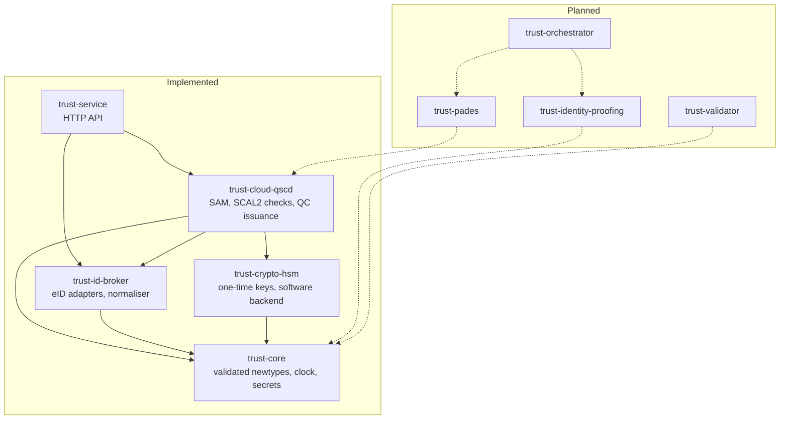
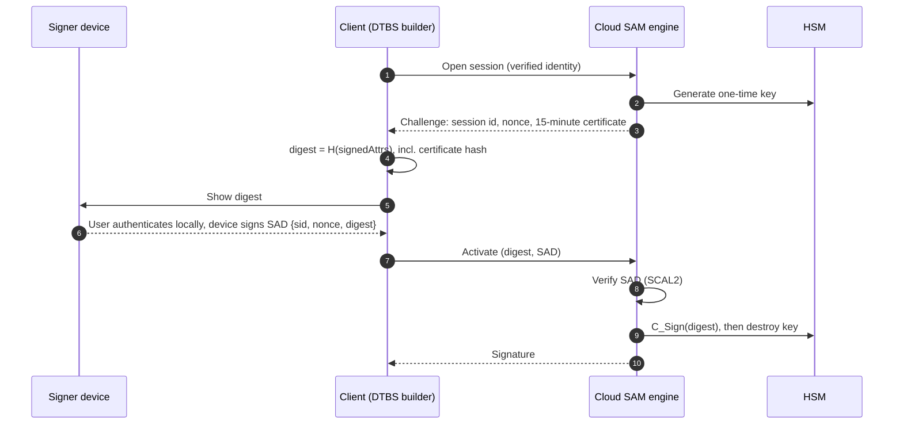
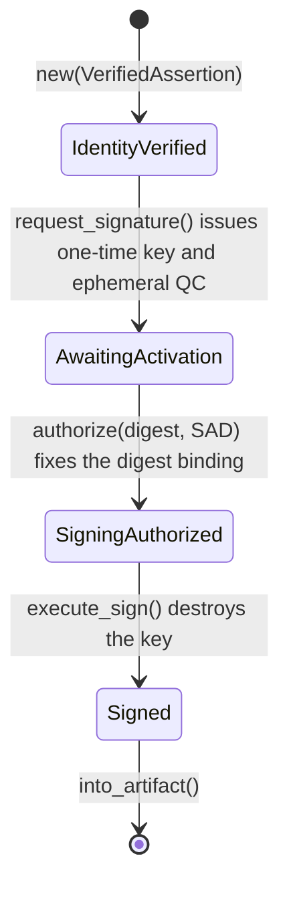
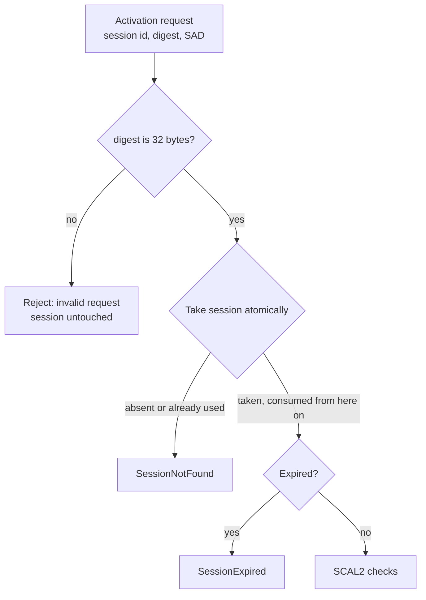
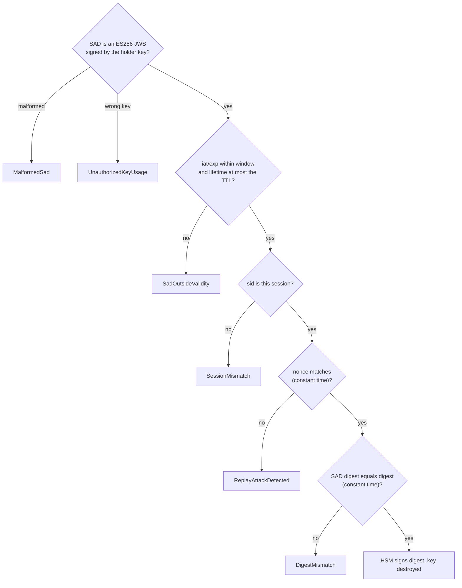

A qualified electronic signature has the legal effect of a handwritten one. That's eIDAS Article 25(2). Nobody else gets to hold your pen. The law expects the same of your signing key.

On a smart card, that's easy. The key never leaves your hand. Remote signing moves the key into a cloud HSM that someone else runs. So what stops the server signing on its own?

CEN EN 419 241 answers with Sole Control Assurance Level 2, or SCAL2. The signer's own device has to authorise each signature. A server-side Signature Activation Module (SAM) checks that authorisation before the HSM does anything.

In my last post I argued for [self-sovereign identity](/blog/linkedin-compliance-2026/) over platform-owned profiles. This is the follow-on. `trust-hub-core` is my Rust take on the identity to signature slice of a remote signing service. One half is an identity broker for national eID OIDC assertions. The other half is a cloud QSCD signing engine that enforces SCAL2. The spec targets Regulation (EU) 910/2014 (eIDAS) as amended by Regulation (EU) 2024/1183 (eIDAS 2.0).

Five diagrams carry the explanation.

## The Crates



Five crates are built. Four are planned, and the dashed edges show where they'd attach. Nothing on a dashed edge exists yet.

`trust-core` holds validated newtypes: `SemanticIdentifier`, `Sha256Digest`, `CanonicalIdentity` and friends, plus the `Clock` and secret types. Every value that crosses a crate boundary is one of these. `trust-id-broker` verifies inbound eID assertions and normalises them. It handles two OIDC schemes today, `nordic_statutory_oidc` and `pseudonymous_oidc`. A SAML scheme for sector identifiers is planned.

`trust-crypto-hsm` defines the signing backend. The only backend so far is `SoftHsm`, a software stand-in shaped like PKCS#11. `trust-cloud-qscd` is the SAM itself. `trust-service` puts an axum HTTP API in front of it all.

The planned crates cover the rest of the platform in the spec. `trust-pades` would build PAdES-B-LTA files. `trust-validator` would run EN 319 102-1 validation against trusted lists. `trust-orchestrator` and `trust-identity-proofing` would handle onboarding. None of them are written.

## The Signing Protocol



The flow is certificate-first. My first version issued the certificate after activation, and the git history shows the change. The reason is PAdES and CAdES. The signature covers the signed attributes, not the PDF. Those attributes must carry a hash of the signer's certificate (ETSI EN 319 142-1 §6.3). So the certificate has to exist before anyone can compute the digest.

Opening a session generates a one-time P-256 key in the HSM. The SAM issues a 15-minute EN 319 412-2 qualified certificate for that key. The client gets a session id, a nonce and the certificate back. It builds the signed attributes and hashes them.

The signer's device shows that digest. The user authenticates locally, and the device signs the Signature Activation Data (SAD). The SAD binds the session id, the nonce and the exact digest. The identity provider attested the device key earlier, in an RFC 7800 `cnf` claim. The SAM checks the SAD against that key. Only then does the HSM sign, and the key is destroyed straight after.

Watch the two keys. The certificate binds the HSM key. The SAD is verified with the device key. Revision 1 of the spec mixed them up. A signature could never have verified under its own certificate. Appendix A of the spec records the fix.

## Invalid States Don't Compile



`SigningSession<S>` is generic over its state. Each state is its own struct with private fields. Each transition takes `self` by value and hands back the session in the new state. Here's the shape, trimmed from `session.rs`:

```rust
pub struct SigningSession<S> {
    identity: CanonicalIdentity,
    state: S,
}

impl SigningSession<AwaitingActivation> {
    pub fn authorize(self, digest: &Sha256Digest, sad: &SadToken, clock: &dyn Clock)
        -> Result<SigningSession<SigningAuthorized>, ActivationError> { /* SCAL2 checks */ }
}

impl SigningSession<SigningAuthorized> {
    pub fn execute_sign(self) -> Result<SigningSession<Signed>, SigningError> { /* sign, destroy key */ }
}
```

`execute_sign` only exists on `SigningSession<SigningAuthorized>`. The only way to get one is through `authorize`, which runs the SCAL2 checks. You can't build one by hand, because the state's fields are private. And since `execute_sign` takes `self`, an authorisation is spent once used.

Four `trybuild` cases pin the compiler's exact output, with one compiling case as a control:

| Attempted misuse | Compiler result |
|---|---|
| Sign before the SAD is verified | `E0599`: `execute_sign` not found for `SigningSession<AwaitingActivation>` |
| Re-authorise a signed session | `E0599`: `authorize` not found for `SigningSession<Signed>` |
| Sign twice with one authorisation | `E0382`: use of moved value |
| Fabricate an authorised state | Private fields block construction |

Revision 1 of the spec had a runtime `InvalidSessionState` error. It's gone. Activation in the wrong state doesn't compile, so there's no runtime case left to handle.

## The Activation Checks

The SAM runs its checks in a fixed order, and the first failure wins. The first two gates guard the session itself:



The digest check runs before the session is touched. A client encoding bug shouldn't burn a good challenge. Then the store takes the session atomically. From that point on it's consumed, whatever happens. A session older than its 5-minute window fails with `SessionExpired`.

The SCAL2 checks follow:



The SAD must be an ES256 JWS signed by the attested device key. The algorithm is pinned, so `alg: none` and HMAC swaps get nowhere. The SAD's `iat` can't be more than 30 seconds ahead of now, and its `exp` can't be more than 30 seconds behind. Its lifetime can't exceed the session's 5 minutes. Its `sid` must name this session. Its nonce and digest must match, and each comparison runs in constant time.

Every error maps to a stable HTTP code. `ReplayAttackDetected` becomes 409 `replay_detected`, and `UnauthorizedKeyUsage` becomes 403 `unauthorized_key_usage`. Any failure after the take drops the session. Dropping it destroys the key.

## Decisions Worth Stealing

**Pin the compile errors.** A type-state design only helps if it stays enforced. The `trybuild` snapshots break when a refactor opens a path the design meant to close. One mutant in the repo's mutation script makes a field of the authorised state public. The snapshot must catch it.

**Consume the session on every attempt.** A retryable session lets anyone who can reach the endpoint grind at the nonce. Failing closed costs an honest client one extra round trip after a mistake. I think that's cheap.

**Issue the certificate first.** It's what PAdES needs. A `const` assertion keeps the 5-minute session TTL below the 15-minute certificate validity. Push the TTL past the certificate's life and the build fails.

**Seal the adapter trait.** `SchemeAdapter` is sealed, so only `trust-id-broker` can produce a `VerifiedAssertion`. "Verified" becomes a property of the type, not a convention. The cost is that every new scheme has to live in that crate. That's deliberate, since verification is the security boundary.

**Inject the clock.** Libraries never read the system clock. Expiry, SAD windows and certificate validity all run off an injected `Clock`. That discipline surfaced a library quietly using the system time. `jsonwebtoken`'s own expiry checks are now off, and `exp` and `nbf` are judged by the injected clock. The broker tests set a `ManualClock` years from today. Any stray read of the real clock fails them.

**Forbid `unsafe` and keep secrets short-lived.** Every crate sets `unsafe_code = "forbid"`. SAD tokens and bearer strings zeroize on drop. `Sha256Digest` has no `PartialEq`, only `ct_eq`, so a plain `==` on a digest won't compile.

## Where It Stands

It isn't production-ready, and the README says so. `SoftHsm` keeps keys in process memory. The CA key is regenerated at start-up, so old certificates stop chaining. There's no `jti` replay cache yet. PAdES packaging, validation and onboarding are still on the roadmap.

What is there is checked hard. The workspace runs 80 tests, plus the compile-fail cases. A mutation script disables 20 security checks, one at a time. Each mutant must fail the test named for it. The code is at [github.com/denismurphy/trust-hub-core](https://github.com/denismurphy/trust-hub-core).
